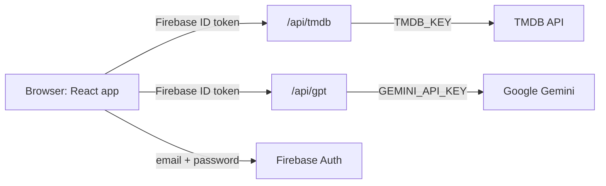

# MSG · AI Movie Discovery

**MSG** is a streaming style movie discovery app. Browse what's playing, ask an AI for movies that match a mood, watch trailers in one click and see exactly where a movie streams in India.

**Live demo:** https://msg-silk.vercel.app

---

## Features

### AI movie search (Gemini)
- Describe a mood, a genre or a moment ("feel good Bollywood comedies", "mind bending sci fi") and get five movie picks.
- Works in **English, Hindi and Spanish**, with one click example searches in each language.
- Every AI pick is matched to TMDB so it shows real posters, details and trailers.
- If Google's main model is overloaded, the server automatically falls back to a lighter model, so searches keep working.

### Browse
- A cinematic hero banner with the current top "Now Playing" movie and its trailer playing muted in the background.
- Six movie rows: **Now Playing, Popular, Best Movies, Horror, Indian and Hollywood**, each loaded from TMDB.
- Rows scroll sideways with arrow buttons on laptops and swipe on phones; posters lift on hover to show the title, year and rating.

### Trailers and movie details
- **Play** opens the trailer full screen with sound.
- **More Info**, or clicking any poster, opens a popup with the backdrop, year, runtime, rating, genres, story and top cast.
- **Where to watch in India:** streaming, free, rent and buy options with service logos (data by JustWatch via TMDB).

### Accounts
- Email and password sign up / sign in with Firebase Authentication, with friendly error messages.
- Protected pages: signed out visitors are sent to the login page, signed in users skip it.

### Design
- Dark theme by default with warm near-black shades and an ember accent, plus a **light mode** toggle that is remembered between visits.
- Custom header (glass effect on scroll, Home / AI Search switch, language picker, theme toggle, profile) and footer.
- Fully responsive from phones to wide screens, with loading placeholders and reduced motion support.

---

## Tech stack

| Area | Tools |
| --- | --- |
| Frontend | React 19, Vite 6, React Router 7 |
| Styling | Tailwind CSS 4 (theme tokens for dark and light mode), Bebas Neue + Inter fonts |
| State | Redux Toolkit, React Redux |
| Auth | Firebase Authentication (email and password) |
| Server | Vercel Functions (Node.js) |
| AI | Google Gemini via `@google/genai` (`gemini-flash-latest`, falls back to `gemini-flash-lite-latest`) |
| Movie data | TMDB API (lists, search, details, videos, watch providers) |
| Token checks | `jose` (verifies Firebase ID tokens on the server) |

---

## How it works

The browser never holds an API key. It talks only to two small server functions, and each request carries the signed in user's Firebase ID token.



- **`api/tmdb.js`** checks the user's token, then forwards the request to TMDB. It only allows the endpoints the app uses (movie lists, details, videos, discover and search).
- **`api/gpt.js`** checks the user's token, asks Gemini for five titles as structured JSON, cleans the list and returns it. The browser then looks each title up through `/api/tmdb`.
- **`api/_lib/auth.js`** verifies Firebase ID tokens against Google's public keys and handles CORS.

---

## Project structure

```
MSG/
├── api/                      Vercel serverless functions (keys live here)
│   ├── _lib/auth.js          Firebase ID token check + CORS
│   ├── gpt.js                POST /api/gpt   -> 5 AI movie picks
│   └── tmdb.js               GET  /api/tmdb  -> TMDB proxy (whitelisted paths)
├── public/                   Favicons and web manifest
├── src/
│   ├── components/
│   │   ├── AuthLayout.jsx    Auth listener, route guard, theme sync
│   │   ├── Header.jsx        Logo, view switch, language, theme, profile
│   │   ├── Footer.jsx
│   │   ├── Login.jsx         Sign in / sign up
│   │   ├── Browse.jsx        Home and AI Search views
│   │   ├── MainContainer.jsx, VideoBackground.jsx, VideoTitle.jsx   Hero banner
│   │   ├── SecondaryContainer.jsx, MovieList.jsx, MovieCard.jsx     Movie rows
│   │   ├── MovieModal.jsx    Trailer player, details, where to watch
│   │   ├── GptSearch.jsx, GptSearchBar.jsx, GptMovieSuggestions.jsx
│   │   └── Logo.jsx, Icons.jsx
│   ├── hooks/                useMovieList, useMovieTrailer, useMovieDetails
│   ├── utils/                Redux slices, API helpers, constants, translations
│   └── index.css             Theme tokens (dark + light) and shared styles
├── .env.example              Environment variables to copy into .env
├── vercel.json               SPA routing for Vercel
└── index.html
```

---

## Getting started

### Prerequisites
- Node.js 20 or newer
- A **Firebase** project with Email/Password sign in enabled
- A **TMDB** account and its "API Read Access Token" ([themoviedb.org/settings/api](https://www.themoviedb.org/settings/api))
- A **Gemini** API key ([aistudio.google.com/apikey](https://aistudio.google.com/apikey))

### Run locally

```bash
git clone https://github.com/MOHILKUMAR/MSG.git
cd MSG
npm install
cp .env.example .env      # then fill in TMDB_KEY and GEMINI_API_KEY
npx vercel dev            # runs the React app and the /api functions together
```

Open the URL it prints (usually http://localhost:3000).

> `npm run dev` starts only the React app. The login page works, but movie rows and AI search need the `/api` functions, so use `npx vercel dev` for local testing.

To use your own Firebase project, replace the config in `src/utils/fireBase.jsx` and set `FIREBASE_PROJECT_ID`.

### Scripts

| Command | What it does |
| --- | --- |
| `npx vercel dev` | App + API functions locally |
| `npm run dev` | React app only (Vite dev server) |
| `npm run build` | Production build into `dist/` |
| `npm run preview` | Serve the production build |
| `npm run lint` | ESLint |

---

## Environment variables

All of these are **server side only** (no `VITE_` prefix), so they never reach the browser. Put them in `.env` for local work and in **Vercel > Project > Settings > Environment Variables** for production (mark the keys as Secret).

| Name | Required | Description |
| --- | --- | --- |
| `TMDB_KEY` | Yes | TMDB "API Read Access Token" |
| `GEMINI_API_KEY` | Yes | Google Gemini API key |
| `GEMINI_MODEL` | No | Main model, default `gemini-flash-latest` |
| `GEMINI_FALLBACK_MODEL` | No | Used when the main model is overloaded, default `gemini-flash-lite-latest` |
| `FIREBASE_PROJECT_ID` | No | Firebase project used to verify logins, default `netflixgpt1-40ee2` |
| `ALLOWED_ORIGIN` | No | Only if the site is hosted outside Vercel (enables CORS for that origin) |
| `VITE_API_BASE_URL` | No | Browser side: base URL of the API when the site is not on Vercel |

---

## Deployment

The app is deployed on **Vercel** and the GitHub repo is connected, so every push to `main` deploys automatically.

1. Import the repo at [vercel.com/new](https://vercel.com/new) (Vite is detected automatically).
2. Add `TMDB_KEY` and `GEMINI_API_KEY` as environment variables.
3. Deploy. Environment variable changes need a redeploy to take effect.
4. In Firebase Console > Authentication > Settings > Authorized domains, add your Vercel domain.

---

## Security

- API keys stay on the server; the JS bundle contains no secrets.
- `.env` and `dist/` are git ignored, and `.vercelignore` keeps `.env` out of CLI deploys.
- Both API functions reject requests without a valid Firebase login.
- The TMDB proxy only forwards the specific read endpoints the app needs.
- The Firebase web config in `src/utils/fireBase.jsx` is public by design; it is not a secret.

---

## Credits

- Movie data and images from [TMDB](https://www.themoviedb.org). This product uses the TMDB API but is not endorsed or certified by TMDB.
- Where to watch data provided by [JustWatch](https://www.justwatch.com).
- AI suggestions by Google Gemini.

---

## Development log

How the project was built, step by step:

- Set up the project with Tailwind
- Header
- Routing
- Built the sign up form
- Built the login form
- Form validation
- useRef hooks
- Firebase setup
- Deploying the app to production
- Created sign up user account
- Implemented sign in and sign up form API
- Created Redux store with userSlice
- Implemented sign out
- Update profile
- Bugfix: sign up user display name and profile picture
- Bugfix: if the user is not logged in, redirect from browse to the login page and vice versa
- Added URLs in the constant file
- Registered for the TMDB API, created an app and got an access token
- Got data from TMDB for the browse page
- Custom hook for the Now Playing movies list API
- Created moviesSlice
- Updated the store with movies data
- Planned the main container and secondary container
- Fetched trailer video data
- Updated the store with trailer video data
- Embedded the video and made it autoplay and mute
- Used Tailwind CSS for the main container UI
- Built the secondary component
- Built the movie list
- Built the movie card
- TMDB image CDN URL
- Made the browse page look great with Tailwind
- usePopularMovies custom hook
- GPT search feature
- GPT search bar
- Multi language feature
- Gemini search API calls
- Fetched GPT movie suggestions from TMDB
- Reused the movie list component for movie suggestions
- Memoization
- Added .env file
- Made the site responsive
- Security: moved the Gemini and TMDB keys to server side Vercel functions
- Fixes: crash on TMDB errors, back button, sign out state, email validation, URL encoding
- Real data for the Best Movies, Horror, Indian and Hollywood rows
- Gemini fallback model when the main model is overloaded
- Trailer player, More Info popup and where to watch in India
- Full UI redesign: dark ember theme, light mode, new header and footer
